# 🛡️ Sentinel-Router (V1.0)
> **The Security-First AI Gateway for Enterprise**

[](https://opensource.org/licenses/MIT)
[](https://www.python.org/downloads/)
[](https://www.docker.com/)
[](https://onnxruntime.ai/)

**Sentinel-Router** is an open-source AI Gateway designed for SecOps teams. It sits between your employees and public AI APIs (like OpenAI), using a **Neural Air-Gap** to prevent sensitive data leaks.

Unlike standard gateways that rely on fragile Regex rules, Sentinel uses a fine-tuned **DistilBERT Neural Network** (running locally via ONNX) to analyze intent and data sensitivity in real-time (<40ms latency).

---

## 🚀 Key Features

* **🧠 Neural Privacy Shield:** A local AI model analyzes every prompt. If PII (Personally Identifiable Information) is detected, the request is **blocked** or **forced to a local model**. Sensitive data never leaves your network.
* **💰 Cost Optimization:** "Easy" tasks (e.g., "Fix this JSON") are automatically routed to cheap local models (DeepSeek/Llama). Only "Complex" tasks are allowed to go to GPT-4o.
* **⚡ Ultra-Low Latency:** The routing engine is compiled to **ONNX**, ensuring minimal overhead (~30-40ms per request) on standard CPUs.
* **🐳 Docker Ready:** Deploys as a single container. Compatible with any OpenAI-compatible client (LangChain, Python SDK, etc.).
* **🛡️ Defense-in-Depth:** Combines Neural analysis with a hard Regex fail-safe for maximum security.

---

## 🏗️ Architecture

Sentinel acts as a smart proxy. You simply point your existing tools to Sentinel's URL instead of OpenAI.

```mermaid
graph LR
    User["User / Chat App"] -->|Request| S["🛡️ Sentinel Gateway"]
    
    S -->|"Analyze (ONNX)"| Brain{"Neural Router"}
    
    Brain -->|"Risk: HIGH"| Local["🏠 Local LLM (DeepSeek)"]
    Brain -->|"Risk: LOW"| Cloud["☁️ OpenAI (GPT-4)"]
    
    Local --> User
    Cloud --> User
```



## ⚡ Quick Start

### Prerequisites
* Docker Desktop installed.
* Ollama installed locally (or any OpenAI-compatible local server).
* Recommendation: `ollama run deepseek-r1:1.5b`

### 1. Installation
Clone the repository:
```bash
git clone https://github.com/Rahul207158/sentinel-router.git
cd sentinel-router
```

### 2. Configuration
Create your environment file from the template. Note: Your keys remain local and are never logged.
```bash
cp .env.example .env
```
Open `.env` and add your keys:
```ini
# Required for Cloud Routing
OPENAI_API_KEY=sk-proj-your-key-here

# URL for Local LLM (Use host.docker.internal to reach Ollama on Mac/Windows)
LOCAL_LLM_URL=http://host.docker.internal:11434
```

### 3. Launch
Build and start the container:
```bash
docker compose up --build
```
Note: The first build will take a moment to automatically download the Neural Model (~250MB) from GitHub Releases.
The Gateway is now active at `http://localhost:8000`.

## 🧪 Usage Examples

You can use Sentinel with any tool that supports OpenAI by changing the `base_url`.

### Option A: Curl (Terminal)

1. **Ask a complex question (Routes to GPT-4):**
```bash
curl http://localhost:8000/v1/chat/completions \
  -H "Content-Type: application/json" \
  -d '{ 
    "model": "gpt-4o", 
    "messages": [{"role": "user", "content": "Explain the thermodynamics of black holes."}] 
  }'
```

2. **Test the Privacy Shield (Routes to Local / Air-Gapped):**
```bash
curl http://localhost:8000/v1/chat/completions \
  -H "Content-Type: application/json" \
  -d '{ 
    "model": "gpt-4o", 
    "messages": [{"role": "user", "content": "Update billing for user alice@example.com."}] 
  }'
```

### Option B: Python (OpenAI SDK)

```python
from openai import OpenAI

client = OpenAI(
    base_url="http://localhost:8000/v1",  # Point to Sentinel
    api_key="unused"                      # Sentinel manages the real keys
)

response = client.chat.completions.create(
    model="gpt-4o",
    messages=[{"role": "user", "content": "Write a Python script to scan ports."}]
)
print(response.choices[0].message.content)
```

## 🛠️ Configuration & thresholds

You can tweak the routing sensitivity in the code (`inference_onnx.py`):

| Variable | Default | Description |
|----------|---------|-------------|
| `PII_THRESHOLD` | 0.3 | Sensitivity (0.0 - 1.0). Lower values are more "paranoid" and block more content. |
| `COMPLEXITY_THRESHOLD` | 0.4 | Difficulty (0.0 - 1.0). Scores above this route to Cloud. Scores below route to Local. |

## 🗺️ Roadmap

- [x] V1.0: Neural Routing, ONNX Optimization, Docker Support (Jan 2026)
- [ ] V1.1: Audit Logging (ELK Stack Integration)
- [ ] V2.0: Agentic Tool Routing & Intent Classification

## 🤝 Contributing

This is an open-source security project. Pull Requests are welcome!

1. Fork the repo.
2. Create your feature branch (`git checkout -b feature/AmazingFeature`).
3. Commit your changes (`git commit -m 'Add some AmazingFeature'`).
4. Push to the branch (`git push origin feature/AmazingFeature`).
5. Open a Pull Request.

**License**: MIT
